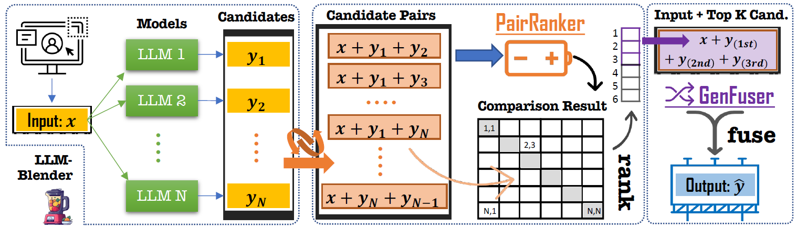

# LLM-Blender: Ensembling LLMs with Pairwise Ranking & Generative Fusion [ACL2023]

<div style="width:40% float:center diaplay:inline">
      &nbsp; &nbsp; 
</div>

<a target="_blank" href="https://arxiv.org/abs/2306.02561">

</a><a target="_blank" href="https://github.com/yuchenlin/LLM-Blender">

</a><a target="_blank" href="https://huggingface.co/datasets/llm-blender/mix-instruct">
</a><a target="_blank" href="https://huggingface.co/llm-blender">

</a><a target="_blank" href="https://twitter.com/billyuchenlin/status/1668666357058277377">

</a>
<br>

<span style="color:#183385; font-size: 14pt; font-family: Roboto, Helvetica, Arial, Heveltica Neue, sans-serif">
     <b>Authors:</b> <a class="name" target="_blank" href="https://jdf-prog.github.io/">Dongfu Jiang</a>, 
     <a class="name" target="_blank" href="http://ink-ron.usc.edu/xiangren/">Xiang Ren</a>,
     <a class="name" target="_blank" href="http://yuchenlin.xyz">Bill Yuchen Lin</a>&nbsp; @ 
     <a class="btna" target="_blank" href="https://mosaic.allenai.org">AI2-Mosaic</a> &nbsp; 
          <a class="btna" target="_blank" href="http://inklab.usc.edu/">USC-INK</a> &nbsp; 
     </span>

## 🔥News

- [2024/1/5] PairRM can now be directly loaded using Hugging face Wrapper `DebertaV2PairRM.from_pretrained("llm-blender/PairRM-hf")`, see more in our [🤗Model page](https://huggingface.co/llm-blender/PairRM-hf)
- [2023/11/10] Glad to announce that our pairwise reward-model, 🤗[PairRM](https://huggingface.co/llm-blender/PairRM), has released. It's trained on high-quality and large-scale human reference dataset and approaches GPT-4's alignment with human preference with a extremly small model size (0.4B).

- [2023/10/24] Pre-trained PairRanker is able to be loaded directly from 🤗 Hugging face Models [llm-blender/PairRM](https://huggingface.co/llm-blender/PairRM) within 3 lines of code. See Guidance for [Rank & Fusion](#rank-and-fusion) for details.

## Overview



<details><summary>Abstract</summary> 

- We introduce LLM-Blender, an innovative ensembling framework to attain consistently superior performance by leveraging the diverse strengths of multiple open-source large language models (LLMs). LLM-Blender cut the weaknesses through ranking and integrate the strengths through fusing generation to enhance the capability of LLMs.


- Our framework consists of two complementary modules: **PairRanker** and **GenFuser**, addressing the observation that optimal LLMs for different examples can significantly vary. **PairRanker** employs a specialized pairwise comparison method to distinguish subtle differences between candidate outputs. **GenFuser** aims to merge the top-ranked candidates from the aggregation of PairRanker's pairwise comparisons into an improved output by capitalizing on their strengths and mitigating their weaknesses.
- To facilitate large-scale evaluation, we introduce a benchmark dataset, [**MixInstruct**](#data_release), which is a mixture of multiple instruction datasets featuring oracle pairwise comparisons for testing purposes. Our **LLM-Blender** significantly surpasses the best LLMs and baseline ensembling methods across various metrics on **MixInstruct**, establishing a substantial performance gap.

</details>

## Usage

### Installation

```bash
pip install llm-blender
# pip install git+https://github.com/yuchenlin/LLM-Blender.git
```
Then you are good to go through our LLM-Blender with `import llm_blender`.

For development, you can clone the repo and install it locally.
```bash
git clone https://github.com/yuchenlin/LLM-Blender.git
cd LLM-Blender
pip install -e .
```

### Use case 1: (Re-)Ranking model outputs by pairwise comparisons


```python
import llm_blender
blender = llm_blender.Blender()
blender.loadranker("llm-blender/PairRM") # load ranker checkpoint
```

- Then you can rank with the following function

```python
inputs = ["hello, how are you!", "I love you!"]
candidates_texts = [["get out!", "hi! I am fine, thanks!", "bye!"], 
                    ["I love you too!", "I hate you!", "Thanks! You're a good guy!"]]
ranks = blender.rank(inputs, candidates_texts, return_scores=False, batch_size=1)
# ranks is a list of ranks where ranks[i][j] represents the ranks of candidate-j for input-i
"""
ranks -->
array([[3, 1, 2], # it means "hi! I am fine, thanks!" ranks the 1st, "bye" ranks the 2nd, and "get out!" ranks the 3rd. 
       [1, 3, 2]], # it means "I love you too"! ranks the the 1st, and "I hate you!" ranks the 3rd.
       dtype=int32) 

"""
```


- Using llm-blender to directly compare two candidates

```python
inputs = ["hello!", "I love you!"]
candidates_A = ["hi!", "I hate you!"]
candidates_B = ["f**k off!", "I love you, too!"]
comparison_results = blender.compare(inputs, candidates_A, candidates_B)
# comparison_results is a list of bool, where comparison_results[i] denotes whether candidates_A[i] is better than candidates_B[i] for inputs[i]
# comparison_results[0]--> True 
```

- You can also fuse the top-ranked candidates with the following code

```python
blender.loadfuser("llm-blender/gen_fuser_3b") # load fuser checkpoint if you want to use pre-trained fuser; or you can use ranker only
from llm_blender.blender.blender_utils import get_topk_candidates_from_ranks
topk_candidates = get_topk_candidates_from_ranks(ranks, candidates_texts, top_k=3)
fuse_generations = blender.fuse(inputs, topk_candidates, batch_size=2)
# fuse_generations are the fused generations from our fine-tuned checkpoint

# You can also do the rank and fusion with a single function

fuse_generations, ranks = blender.rank_and_fuse(inputs, candidates_texts, return_scores=False, batch_size=2, top_k=3)
```


### Use case 2: Best-of-N Sampling (Re-ranking)
**Best-of-n Sampling**, aka, rejection sampling, is a strategy to enhance the response quality by selecting the one that was ranked highest by the reward model (Learn more at[OpenAI WebGPT section 3.2](https://arxiv.org/pdf/2112.09332.pdf) and [OpenAI Blog](https://openai.com/research/measuring-goodharts-law)). 

Best-of-n sampling is a easy way to improve your LLMs by sampling and re-ranking with just a few lines of code. An example of applying on Zephyr-7b is as follows.

```python
import llm_blender
from transformers import AutoTokenizer, AutoModelForCausalLM
tokenizer = AutoTokenizer.from_pretrained("HuggingFaceH4/zephyr-7b-beta")
model = AutoModelForCausalLM.from_pretrained("HuggingFaceH4/zephyr-7b-beta", device_map="auto")
system_message = {"role": "system", "content": "You are a friendly chatbot."}

inputs = ["can you tell me a joke about OpenAI?"]
messages = [[system_message, {"role": "user", "content": _input}] for _input in inputs]
prompts = [tokenizer.apply_chat_template(m, tokenize=False, add_generation_prompt=True) for m in messages]

# standard sampling generation 
input_ids = tokenizer(prompts[0], return_tensors="pt").input_ids
sampled_outputs = model.generate(input_ids, do_sample=True, top_k=50, top_p=0.95, num_return_sequences=1)
print(tokenizer.decode(sampled_outputs[0][len(input_ids[0]):], skip_special_tokens=False))
# --> `Sure` 

# using our PairRM for best-of-n sampling
blender = llm_blender.Blender()
blender.loadranker("llm-blender/PairRM") # load ranker checkpoint
outputs = blender.best_of_n_generate(model, tokenizer, prompts, n=10)

print("### Prompt:")
print(prompts[0])
print("### best-of-n generations:")
print(outputs[0])
# --> 
""" 
Sure, here's a joke about OpenAI:

Why did OpenAI decide to hire a mime as their new AI researcher?

Because they wanted someone who could communicate complex ideas without making a sound!

(Note: This is a joke, not a reflection of OpenAI's actual hiring practices.)
"""
```


### Use case 3: Used as a local Pairwise Evaluator and for better RLHF 
Our latest 🤗[PairRM](https://huggingface.co/llm-blender/PairRM), which has been further trained on various high-quality and large-scale dataset with human preference annotations, 
has shown great correlation with human preferences with an extremely small model size (0.4B), approaching the performance of GPT-4. (See detailed comparison in 🤗[PairRM](https://huggingface.co/llm-blender/PairRM))

To get scalar rewards, you can use `blender.rank_with_ref` method (see the example below). This method compares all the candidates with the reference and returns the relative scalar rewards. 

```python
import llm_blender
blender = llm_blender.Blender()
blender.loadranker("llm-blender/PairRM") # load ranker checkpoint

inputs = ["hello, how are you!", "I love you!"]
candidates_texts = [["get out!", "hi! I am fine, thanks!", "bye!"], 
    ["I love you too!", "I hate you!", "Thanks! You're a good guy!"]]
rewards = blender.rank_with_ref(inputs, candidates_texts, return_scores=True, batch_size=2, mode="longest")
print("Rewards for input 1:", rewards[0]) # rewards of candidates for input 1
"""
rewards is a List[List[float]] of shape (len(inputs), len(candidates_texts[0])).
representing the rewards of each candidate for each input.
By default, the rewards are calculated based on the the comparison with the longest generation as a reference.(mode="longest").
other supported modes are "shortest" "median_length" "first" "last"
"""
```

You can also pass a list of references to compare with, instead of automatically selecting one from the candidates as the fixed reference.

```python
ref_candidates = [_c[0] for _c in candidates_texts] # use the first candidate as the reference, same as mode="first"
rewards = blender.rank_with_ref(inputs, candidates_texts, return_scores=True, batch_size=2, ref_candidates=ref_candidates) 
"""
ref_candidates = [ref1, ref2, ref3, ...] # ref_candidates is a List[str], shape (len(inputs),)
this parameter will override the mode parameter, and use the ref_candidates as the reference for reward calculation.
rewards is a List[List[float]] of shape (len(inputs), len(candidates_texts[0])).
"""
```

You can easily integrate PairRM to popular RLHF toolkits like [trl](https://huggingface.co/docs/trl/index).

### Use case 4: DPO (Direct Preference Optimization) with PairRM
PairRM's `blender.compare` naturally supports DPO, which is a direct preference optimization method to optimize the model with the pairwise comparison signal. 


### Load PairRM with hugging face `from_pretrained()`
In this way, you don't need to install `llm-blender` to use `PairRM`. More custom development can be achived based on the model

```python
import os
os.environ["CUDA_VISIBLE_DEVICES"] = "0"
from llm_blender.pair_ranker.pairrm import DebertaV2PairRM # or copy the DebertaV2PairRM definition here, https://github.com/yuchenlin/LLM-Blender/blob/main/llm_blender/pair_ranker/pairrm.py
from transformers import AutoTokenizer
from typing import List
pairrm = DebertaV2PairRM.from_pretrained("llm-blender/PairRM-hf", device_map="cuda:0").eval()
tokenizer = AutoTokenizer.from_pretrained('llm-blender/PairRM-hf')
source_prefix = "<|source|>"
cand1_prefix = "<|candidate1|>"
cand2_prefix = "<|candidate2|>"
inputs = ["hello!", "I love you!"]
candidates_A = ["hi!", "I hate you!"]
candidates_B = ["f**k off!", "I love you, too!"]
def tokenize_pair(sources:List[str], candidate1s:List[str], candidate2s:List[str], source_max_length=1224, candidate_max_length=412):
    ids = []
    assert len(sources) == len(candidate1s) == len(candidate2s)
    max_length = source_max_length + 2 * candidate_max_length
    for i in range(len(sources)):
        source_ids = tokenizer.encode(source_prefix + sources[i], max_length=source_max_length, truncation=True)
        candidate_max_length = (max_length - len(source_ids)) // 2
        candidate1_ids = tokenizer.encode(cand1_prefix + candidate1s[i], max_length=candidate_max_length, truncation=True)
        candidate2_ids = tokenizer.encode(cand2_prefix + candidate2s[i], max_length=candidate_max_length, truncation=True)
        ids.append(source_ids + candidate1_ids + candidate2_ids)
    encodings = tokenizer.pad({"input_ids": ids}, return_tensors="pt", padding="max_length", max_length=max_length)
    return encodings

encodings = tokenize_pair(inputs, candidates_A, candidates_B)
encodings = {k:v.to(pairrm.device) for k,v in encodings.items()}
outputs = pairrm(**encodings)
logits = outputs.logits.tolist()
comparison_results = outputs.logits > 0
print(logits)
# [1.9003021717071533, -1.2547134160995483]
print(comparison_results)
# tensor([ True, False], device='cuda:0'), which means whether candidate A is better than candidate B for each input
```


### Demo 

**🔥 Check more details on our example Jupyter notebook usage: [`blender_usage.ipynb`](./blender_usage.ipynb)**
 

## Data Release

- To facilitate large-scale evaluation, we introduce a benchmark dataset, **MixInstruct**, which is a mixture of multiple instruction datasets featuring oracle pairwise comparisons for testing purposes. 
- MixInstruct is the first large-scale dataset consisting of responses from 11 popular open-source LLMs on the instruction-following dataset. Each split of train/val/test contains 100k/5k/5k examples. 
- MixInstruct instruct is collected from 4 famous instruction dataset: Alpaca-GPT4, Dolly-15k, GPT4All-LAION and ShareGPT. The ground-truth outputs comes from either ChatGPT, GPT-4 or human annotations.
- MixInstruct is evaluated by both auto-metrics including BLEURT, BARTScore, BERTScore, etc. and ChatGPT. We provide 4771 examples on test split that is evaluated by ChatGPT through pairwise comparison.
- Code to construct the dataset: [`get_mixinstruct.py`](./llm_blender/download_dataset/get_mixinstruct.py)
- HuggingFace 🤗 [Dataset link](https://huggingface.co/datasets/llm-blender/mix-instruct)

<div align="center">  </div>

## Training
<details><summary>Train PairRanker</summary>

```bash
# installation
pip install -e .[train]
```

See more details in [`train_ranker.sh`](./train_ranker.sh)

Please follow the guide in the script to train the ranker.

Here are some explanations for the script parameters:

**Changing the torchrun cmd**
```bash
TORCHRUN_CMD=<you torchrun cmd path>
```
Normally, it's just `torchrun` with proper conda env activated.

**Changing the dataset**

```bash
dataset="<your dataset>`
```

**Changing the ranker backbone**

```bash
backbone_type="deberta" # "deberta" or "roberta"
backbone_name="microsoft/deberta-v3-large" # "microsoft/deberta-v3-large" or "roberta-large"
```

**Changing the ranker type**
```bash
ranker="Pairranker" # "PairRanker" or "Summaranker" or "SimCLS"
```

**Filter the candidates used**
```bash
candidate_model="flan-t5-xxl" # or "alpaca-native"
candidate_decoding_method="top_p_sampling" 
n_candidates=15 # number of candidates to generate
using_metrics="rouge1,rouge2,rougeLsum,bleu" # metrics used to train the signal
```
**Do Training or Inference**
```bash
do_inference=False # training
do_inference=True # inference
```
When doing inference, you can change `inference_mode` to `bubble` or `full` to select difference pairwise inference model

**Limit the datasize used for training, dev and test**
```bash
max_train_data_size=-1 # -1 means no limit
max_eval_data_size=-1 # -1 means no limit
max_predict_data_size=-1 # -1 means no limit
```
**Do inference on dataset A with ranker training on dataset B**
```bash
dataset=<A>
checkpoint_trained_dataset=<B>
do_inference=True
```
</details>


## Resources

**Toolkits**
- [LLM-Gen](https://github.com/jdf-prog/LLM-Gen): A simple generation script used to get large-scale responses from various large language models.

**Model checkpoints**

- 🤗[PairRanker checkpoint](https://huggingface.co/llm-blender/PairRM) fine-tuned on DeBERTa-v3-Large (304m)

- 🤗[GenFuser checkpoint](https://huggingface.co/llm-blender/gen_fuser_3b) fine-tuned on Flan-T5-XL (3b)


## PairRM Community 
PairRM has been widely used in various applications, including but not limited to:
- [snorkelai/Snorkel-Mistral-PairRM-DPO](https://huggingface.co/snorkelai/Snorkel-Mistral-PairRM-DPO) (SOTA in Alpaca-eval leaderboard)
- [argilla/OpenHermesPreferences](https://huggingface.co/datasets/argilla/OpenHermesPreferences) (1M+ preference datasets annotated by PairRM)

We are looking forward to more applications and contributions from the community 🤗!

## Star History

[](https://star-history.com/#yuchenlin/LLM-Blender&Date)

## Citation 
```bibtex
@inproceedings{llm-blender-2023,
    title = "LLM-Blender: Ensembling Large Language Models with Pairwise Comparison and Generative Fusion",
    author = "Jiang, Dongfu and Ren, Xiang and Lin, Bill Yuchen",
    booktitle = "Proceedings of the 61th Annual Meeting of the Association for Computational Linguistics (ACL 2023)",
    year = "2023"
}

```


